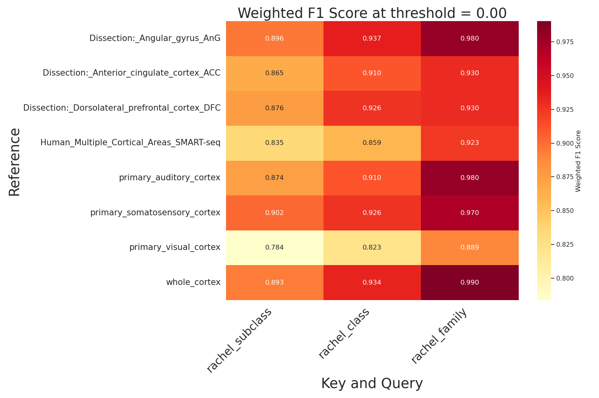
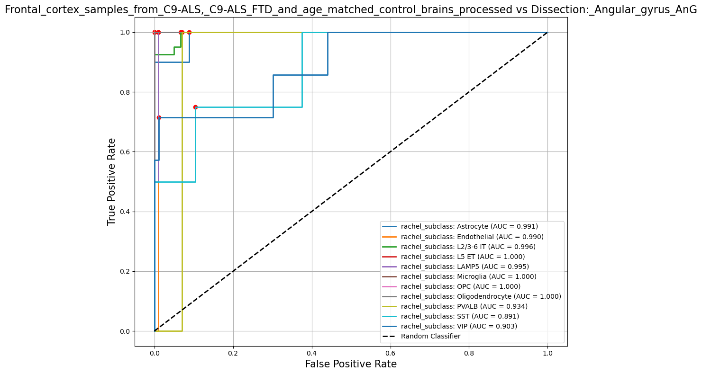
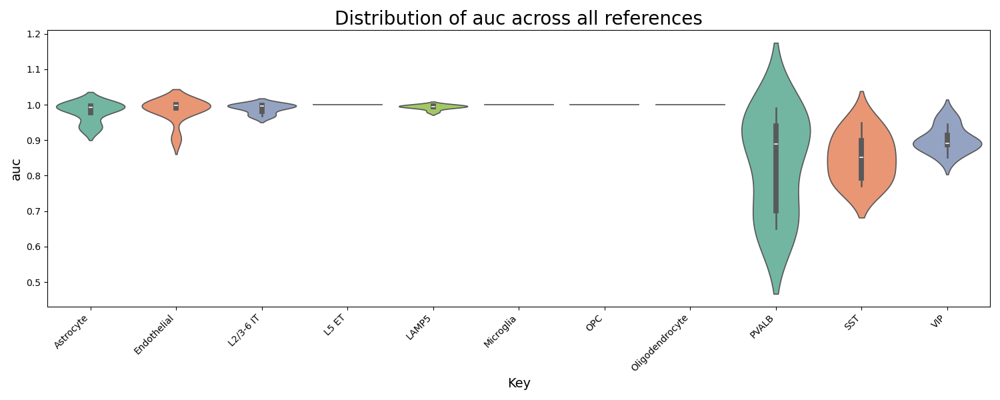

# Evaluation of Multiple Reference Datasets for Cell Type Prediction

## Usage

running with defaults:

```
nextflow main.nf -profile docker
```
is equivalent to running:

```
nextflow main.nf
               -profile docker \
               --organism homo_sapiens \
               --census_version 2024-07-01
               --cutoff 0 \
               --query query/* \
               --refs refs/*
               --relabel_q meta/gittings_relabel.tsv.gz \
               --relabel_r meta/census_map_human.tsv \
```


### Dependencies

```
docker v4.35.1
nextflow v24.10.0
```

## Background and Rationale

Single-cell expression is a powerful tool for investigating cell-type-specific differences in gene expression within the context of disease, which can deepen our understanding and suggest avenues for treatment. Large amounts of these data have been collected, offering exciting opportunities for meta-analysis. However, in practice this is challenging in part due to a lack of cell-type annotations in public data repositories such as the Gene Expression Omnibus (GEO), as well as inconsistency in any available annotations [1]. Additionally, any new single-cell data that is generated may disagree with prior literature on account of differing annotation strategies between research groups. Single-cell researchers often align their data to "reference datasets" using machine learning classifiers such as KNN, logistic regression, SVM and Random Forest. Most of these classifiers perform well when the reference and query are closely aligned, but which reference of many public datasets to is difficult to predict [2][3]. Additionally, model and reference performance is impossible to evaluate without first aligning the "ground truth" reference and query labels manually. Here I present a workflow for evaluating the performance of a Random Forest classifier for single-cell human neocortex on a collection of references from multiple cortical areas, using a manually aligned 'ground truth' derived from the BRAIN initiative cell type taxonomy. The workflow presented is scalable to one query dataset.


### Workflow description

This pipeline evalutates a random forest classification task on a toy query dataset given 8 reference datasets with a 3-level cell type hierarchy. The test or "query" data comes from a study of human adult prefrontal cortex in ALS patients and matched controls [4], while the references comprise 8 datasets from a popular "atlas" of multiple healthy human adult cortical areas [5], as well as all 8 datasets aggregated (`whole cortex`). All libraries were prepared using 10x 3' v3 kits from 10x Genomics with the exception of denoted SMART-seq dataset [8][9]. The references have been pre-downloaded from the CellxGene Discover Census [6], and have pre-generated embeddings from a variational autoencoder model `scvi` [7] trained on all cells in the CellxGene data corpus. 

### Steps
1. The pre-trained `scvi` model file is fetched given the organism and CellxGene census version
2. The query data is passed through the pre-trained model.
3. For each reference file provided, a random forest classifier fitted to the reference embeddings.
    1. The classifier predicts probabilities for each query cell given embeddings from the pre-trained model passs at the most granular level.
    2.. The user can optionally filter the proabilities by a threshold.
    3. ROC curves for each individual label are computed and plotted.
    4. predictions aggregated using the cell type hierarchy tree into broader labels. This ensures that granular predictions correspond to their higher-level predictions, which may not be the case if we fit a classifier separately at each level.
    5. A classification report is generated for each set of predictions. F1 scores are saved to disk. Confusion matrices are plotted for each label.
    6. Cell metadata with predictions is written to `images/results/predicted_meta`.
4. The distribution of AUC scores and Youden's J statistics (the `optimal threshold` are plotted across all reference/combinations.
5. F1 scores are read from disk and plotted for all reference/query combindations as heatmaps.

### DAG


### Source code 
Source functions for individual processes can be found in `/bin/adata_functions.py`. Scripts used to download reference and query data are likewise avaialable in `/bin`.

## Inputs
Toy datasets have been provided in the `refs` and `query` directories. These data are downsampled to comply with Github and Docker's memory requirements. As such, the evaluation may not be an accurate assessment of classification performance. The threshold has been set to `0` by default. Setting a threshold is another challenging task, which for now is outside the scope of this pipeline.

Importantly, during the pipeline run, query and reference data are mapped to a shared "ground truth" set of hierarchical labels defined in `meta.master_hierarchy.json`. I have generated the mapping files (`census_map_human.tsv` and `gittings_relabel.tsv`) for the purposes of this demo, but a user-supplied query would need to perform this mapping manually. These harmonized labels are used for classification and evaluation.


## Output

### Repo Structure

Results will be published in the `results` directory. An example repo structure can be found under `images/results`. These include cell type predictions, F1 scores for each cell type, weighted F1 scores, AUC values, Youden's J statistics, and associated figures.

### Sample results




Fig 1. Aggregated F1 scores weighted by class for each level of cell type hierarhcy. 

Fig 2. F1 scores by class at 3 levels of hierarchy.
Primary somatosensory cortex, wole cortex and angular gyrus achieve the highest weighted F1 for our test data. Endothelial cells, deep layer non-IT excitatory neurons, and PVALB interneurons are the most difficult to predict in our test data. Considerations forwhich reference to use should be informed by what cell type we're most interested in.




Fig 3. Visualization of ROC and optimal threhsold (red point) for a given reference-query combination. These ROC and AUC scores dont' account forthe multi-class nature of our classification problem– for example, although PVALB interneurons can be detected when labels are binarized, because Chandielier neurons achieve higher probabilities, they typically aren't classified correctly in our final classification report. One way around this would be to alter the code to provide a vector of thresholds for each class, so that classes which tend to have higher optimal thresholds can't influence classes with lower optimal thresholds.




Fig 4-5. Distribution of AUC and optimal threshold (Youden's J statistic) across references per class. Classes with the highest optimal thresholds (L5 ET, Microglia, OPC, Oligodendrocyte) all achieve perfect AUC. Since this workflow doesn't permit passing a vector of thresholds, we may want to set the threshold to something in the middle, to avoid falsely classifying groups with low optimal thresholds as one of these classes. Alternatively, a mean or median threshold can be computed from results in `images/results/roc`. 

## Container

I have built a custom Docker container for use with this pipeline; its configuration can be found in `bin/Dockerfile` and `bin/requirements.txt`. The project directory is mounted to the base directory of the container via the config:

```
profiles {
  conda {
    conda.enabled=true
    process.conda = '/Users/Rachel/miniconda3/envs/censusenv'
   }

  docker {
    process.container = 'raschwaa/census-pipeline:latest'
    docker.enabled = true
    runOptions = "-v $projectDir:/biof501_proj$projectDir -m 8g --memory-swap -1"
    temp = 'auto'
  }
}
```

Reading `hdf5` formatted files can be memory intensive in Docker; I suggest keeping the memory limit and swap limit as is. Alternatively, to avoid running the Docker VM, you can create a conda environment with dependencies outlined in `requirements.txt` file and replace the path in the conda profile with the path to your environment. The workflow can then be run with `-profile conda`.


## References

1. Puntambekar S, Hesselberth JR, Riemondy KA, Fu R. Cell-level metadata are indispensable for documenting single-cell sequencing datasets. Koo BK, editor. PLoS Biol. 2021 May 4;19(5):e3001077.
2. Pasquini G, Rojo Arias JE, Schäfer P, Busskamp V. Automated methods for cell type annotation on scRNA-seq data. Computational and Structural Biotechnology Journal. 2021;19:961–9.
3. Lotfollahi, Mohammad, Yuhan Hao, Fabian J. Theis, and Rahul Satija. “The Future of Rapid and Automated Single-Cell Data Analysis Using Reference Mapping.” Cell 187, no. 10 (May 2024): 2343–58. https://doi.org/10.1016/j.cell.2024.03.009.
4. Gittings, L.M., Alsop, E.B., Antone, J. et al. Cryptic exon detection and transcriptomic changes revealed in single-nuclei RNA sequencing of C9ORF72 patients spanning the ALS-FTD spectrum. Acta Neuropathol 146, 433–450 (2023). https://doi.org/10.1007/s00401-023-02599-5
5. Jorstad, Nikolas L., Jennie Close, Nelson Johansen, Anna Marie Yanny, Eliza R. Barkan, Kyle J. Travaglini, Darren Bertagnolli, et al. “Transcriptomic Cytoarchitecture Reveals Principles of Human Neocortex Organization.” Science 382, no. 6667 (October 13, 2023): eadf6812. https://doi.org/10.1126/science.adf6812.
6. CZI Single-Cell Biology Program, Shibla Abdulla, Brian Aevermann, Pedro Assis, Seve Badajoz, Sidney M. Bell, Emanuele Bezzi, et al. “CZ CELL×GENE Discover: A Single-Cell Data Platform for Scalable Exploration, Analysis and Modeling of Aggregated Data,” November 2, 2023. https://doi.org/10.1101/2023.10.30.563174.
7. Lopez, Romain, Jeffrey Regier, Michael B. Cole, Michael I. Jordan, and Nir Yosef. “Deep Generative Modeling for Single-Cell Transcriptomics.” Nature Methods 15, no. 12 (December 2018): 1053–58. https://doi.org/10.1038/s41592-018-0229-2.
8. Chromium Single Cell V(D)J Reagent Kits with Feature Barcoding technology for Cell Surface Protein, Document Number CG000186 Rev A, 10x Genomics, (2019, July 25).
9. Takara Bio USA, Inc. (n.d.). SMART-Seq® v4 Ultra® Low Input RNA Kit for Sequencing. 

